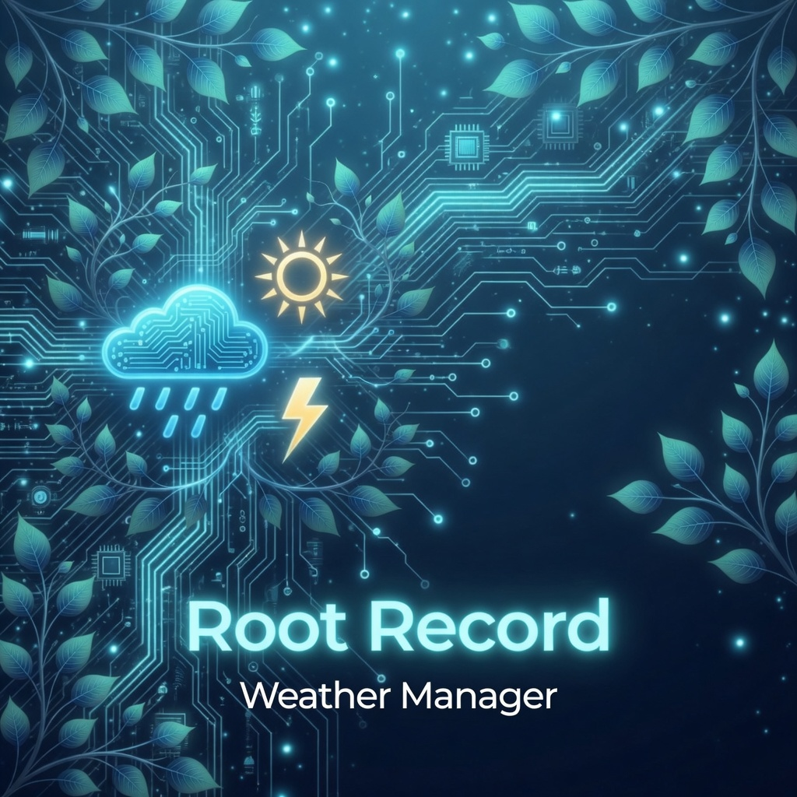
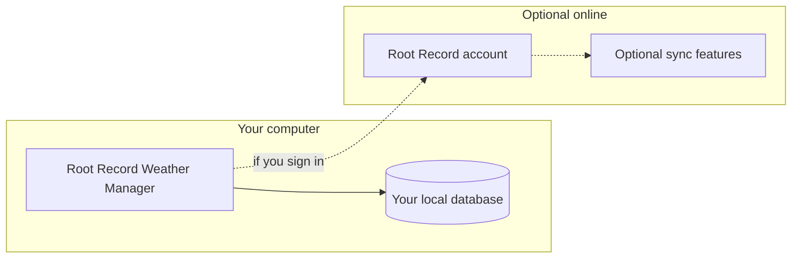

> **Root Record Weather Manager** — product overview, download links, and release notes. The Windows installer is attached to **GitHub Releases** only (not stored in git).

---

# Root Record Weather Manager

**One calm desktop window for weather, alerts, earthquakes, and hazard context for the places you care about - built for people who want clarity without juggling a dozen browser tabs.**

Current release: **1.0.17** (see **About** in the app for the exact build on your device.)

**What is new in 1.0.17:** Bumped the published Windows installer and in-app update line for a fresh **GitHub Release**; use **Releases** for the installer. **1.0.16** and earlier: **in-app** checks for **GitHub Releases** on a schedule; **About → Check for updates…** runs the same update flow; **guest** sessions show a clear sign-in state and cap some live public-data refresh compared to a signed-in plan; the Windows **taskbar** and window use a stable app identity and branded **.ico** where the build ships one. **Your locations, history, and database stay on your machine**.

**[Download the Windows installer (latest release)](https://github.com/RootRecord/rootrecord-weather-manager-download/releases/latest)**

[Website](https://rootrecord.com/) | [Terms](https://rootrecord.info/terms) | [Privacy](https://rootrecord.info/privacy) | [Contact](https://rootrecord.info/contact)

---

## Table of contents

1. [Why Root Record](#why-root-record)
2. [Who it is for](#who-it-is-for)
3. [At a glance](#at-a-glance)
4. [How your data works](#how-your-data-works)
5. [Feature tour](#feature-tour)
6. [Account, billing, and optional online services](#account-billing-and-optional-online-services)
7. [Privacy & security](#privacy--security)
8. [System requirements](#system-requirements)
9. [Getting started](#getting-started)
10. [FAQ](#faq)
11. [Support](#support)

---

## Why Root Record

Staying ahead of **weather**, **alerts**, and **natural hazards** means pulling information from many sources. Most people end up with a row of browser tabs, each with a different map, a different list, and a different refresh rhythm.

**Root Record Weather Manager** brings those signals into a **single, fast Windows desktop application** that:

* **Centers on your locations** - name and save the places that matter; forecasts and hazard views follow those coordinates instead of a generic default city.
* **Keeps useful history on your machine** - scroll back, compare, and work from what you already retrieved without starting from zero every session.
* **Surfaces what matters** - U.S. and Canada weather alerts, earthquake and tsunami feeds where configured, radar and satellite imagery, and optional hazard context layers with sensible links to authoritative sources.
* **Treats online features as optional** - you can **continue without signing in** for a **free local** session (with clear limits for guest refresh behavior), or sign in for plan features such as **stronger alerts**, **custom sounds**, and **Root Record**-aligned services where your tier allows it.

This document is written for **customers and evaluators**. Step-by-step help also lives **inside the app** under **About** and **Settings**.

---

## Who it is for

| Audience | What you get |
| --- | --- |
| **Homeowners and families** | Watch weather and hazards for home, school, and relatives' towns in one place. |
| **People in alert-heavy regions** | Scan U.S. and Canada weather alerts with geography tied to your saved locations. |
| **Earthquake- and tsunami-aware users** | Follow public earthquake feeds and tsunami information in layouts tuned for quick reading. |
| **Operators who prefer the desktop** | One install, one window, local data - not another pinned tab farm. |

---

## At a glance

|  | Capability |
| --- | --- |
| **Saved locations** | Add and name places on a map; forecasts and many hazard views respect those coordinates. |
| **Weather alerts** | Active alerts for the United States and Canada, filtered toward your geography where applicable. |
| **Earthquakes &amp; tsunamis** | Public feeds and clear layouts for scanning magnitude, region, and timing. |
| **Forecasts &amp; imagery** | Observations, satellite stills, and radar-style loops where the app is configured to show them. |
| **Broader hazard context** | Optional layers (for example wildfires and tropical systems) with links to authoritative sources. |
| **Backups** | Local database backups when you use the app’s backup tools - treat exported files like any important document. |
| **Updates** | Installed builds check this repo’s **GitHub Releases** via the in-app updater; you choose when to download and restart. |

---

## How your data works

Your **saved locations, preferences, and local database** live under **your Windows user profile** in a dedicated **Root Record** folder (the app can show you the path in **About**). That design means:

* **You own the folder** - back it up before reinstalling Windows or moving PCs.
* **You stay useful when connectivity drops** - history you already stored stays readable; live maps and feeds need a network path.
* **Optional online services are exactly that - optional** - sign-in ties into Root Record licensing and optional sync-style features when you use them; they are not required for core public-data monitoring.

**Optional sync** (when signed in and available for your plan) exchanges **supported** updates with your account. It is **not** a substitute for keeping your own **backups** of the local data.

---

## Feature tour

### Locations and maps

Pick **where** the app should care: save one or more locations, name them, and use the map to stay oriented. Many views key off those coordinates so you are not limited to a single preset city.

### Alerts and hazards

Review **active weather alerts** for the U.S. and Canada, **earthquake** activity from public feeds, and **tsunami** information where provided - arranged so you can scan quickly when minutes matter.

### Forecasts and imagery

Step through **forecasts**, **observations**, and **imagery** (including satellite and radar-style loops) from **Settings** and the main layout.

### Account-linked extras

On supported tiers, sign-in can unlock **stronger alert behavior** and **custom alert sounds**. **Your plan and what is included** are always shown **in the app**.

---

## Account, billing, and optional online services

* **Sign-in** links this installation to your **Root Record account** when you want account-backed features and billing.
* **Free local / guest** use: you can open the app without signing in; the sign-in experience returns until you create or use an account, and some live public-data refresh and cloud features are **limited** compared to a signed-in plan. See **in-app** messaging.
* **Billing** follows Root Record’s secure flows when you upgrade or manage a plan.
* **Optional sync** (when available for your account) keeps **supported** record types aligned - see the app for scope.

If billing needs attention, the app explains what is limited until you update payment, without hiding your local history.

---

## Privacy & security

| Topic | What you should know |
| --- | --- |
| **Primary storage** | Your database and preferences stay on your PC under your profile unless you or IT redirect them. |
| **Saved locations** | Names and coordinates you enter are stored for your use on device. Account-related flows use HTTPS when you sign in or use online features. |
| **Backups** | Files you export or snapshot land where **you** save them - treat them like sensitive personal data. |
| **Sign-in** | Uses industry-standard HTTPS to Root Record services as described in the product; session handling is designed for desktop use. |

For policies governing websites and online services, see **Privacy** and **Terms** below.

---

## System requirements

|  | Minimum guidance |
| --- | --- |
| **Operating system** | **Windows 10** or **Windows 11** (**64-bit / x64**). The **Releases** installer is built for **64-bit Windows**. |
| **Display** | **1280×720** or larger recommended; the interface is optimized for modern widescreen laptops and room for maps beside panels. |
| **Disk** | Modest install footprint; allow generous free space for local history, cache behavior, and **backups**. |
| **Network** | Required for live maps, imagery, and public data feeds; sign-in, sync, and optional services need connectivity when you use them. |

**Signed** Windows installers, when we publish with Authenticode, are easier to run on strict security policies. See each **Release** for what we shipped that version.

---

## Getting started

1. **Install** from the **latest** [GitHub release](https://github.com/RootRecord/rootrecord-weather-manager-download/releases/latest) (Windows **.exe** installer) or your IT package.
2. **Open the app** and add **at least one saved location** - the app waits for that before it loads a full set of live feeds, so it knows which places you care about.
3. **Review** **About** and **Settings** for coverage, alert options, **Check for updates…** (on installed builds), and backup.
4. **Optional** - sign in for plan features; or keep a **local / guest** session and upgrade when you are ready.

---

## FAQ

**Why is nothing loading yet?**  
Add and **save** at least one **location** so the app knows your geography.

**Do you sell my saved locations?**  
No. They are for **your** on-device use. Only flows you start (sign-in, optional services) use Root Record servers as described in-app and in our policies.

**Can I back up my data?**  
Use the app’s **backup** tools; copy your data folder when moving PCs - see **About** for the path.

**Do I need a subscription?**  
Core public-data monitoring is available in free local and guest modes; some **alerts and sounds** are plan-gated. The app states what is included for your build.

**What does "Continue without signing in" do?**  
A **local / guest** path: your data can stay on the PC; **Pro**-only and some live refresh options stay limited until you sign in on a plan that offers them. Use **Settings** to sign in when you want the full product.

**How do updates work?**  
The **installed** app uses **GitHub Releases** in this repository (and **`latest.yml`**) to offer **in-app** updates. You are prompted to **download**, then **restart** when a newer build is available.

**Is the Microsoft Store version the same?**  
Store and GitHub are separate **distribution** paths; the app is built to behave consistently, but your update path follows your **install** source. See the **Release** you installed from for details.

---

## Support

* **Product website:** [https://rootrecord.com/](https://rootrecord.com/)
* **Contact:** [https://rootrecord.info/contact](https://rootrecord.info/contact)
* **Terms:** [https://rootrecord.info/terms](https://rootrecord.info/terms)
* **Privacy:** [https://rootrecord.info/privacy](https://rootrecord.info/privacy)

For field-by-field help, open **About** and in-app help where the product shows it.

---

© RootRecord. All rights reserved.  
*Root Record Weather Manager* | Release documentation **1.0.17**
